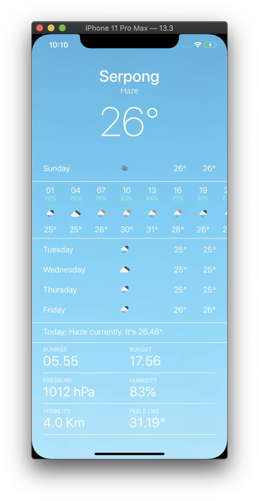

# Sky Watch App with SwiftUI

## Overview

`Sky Watch App` is replicate design from `Apple Weather App` uses [Openweathermap API](https://openweathermap.org/api) and build with SwiftUI. Feature this app same with apple weather like get current weather & details, get hourly forecast weather and get daily forecast. But detail not fully same because limited feature free plan from Openweathermap API.

### Keyword
- SwiftUI
- JSON & Codable
- MVVM
- ObservableObject

### Prerequisites

- A valid API key from Openweathermap
- A Mac running macOS Catalina
- Xcode 11.3.1
